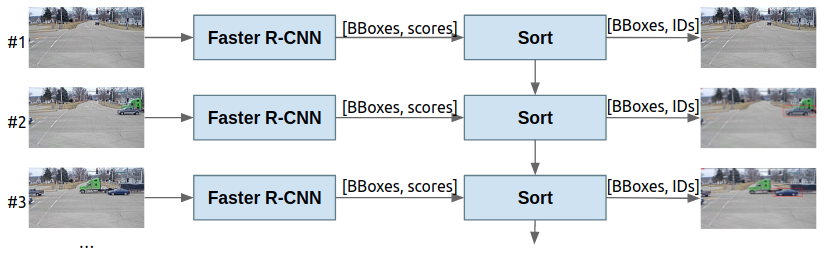

## Video Surveillance for Road Traffic Monitoring

This project is devoted to explore Computer Vision video techniques to track cars across multiple cameras at a single intersection and multiple intersections spreading out in a mid-size city.

The dataset used is a subset of 3 sequences of the *AI City dataset*. This dataset offers 3.25 hours of videos showing road intersections and driving vehicles. 40 cameras were used in 10 different intersections. The dataset also offers the frame-by-frame bounding boxes of each vehicle, giving a total of 229,680 bounding boxes for 666 different vehicles.

In addition to the main challenge in this repository there are several studies done such as background estimation and optical flow estimation and representation. The corresponding detailed expositions are inside the w1, w2, w3 and w4 folders. However, all the code corresponding to the main challenge is in the w5 folder.

[Week 1 - Database, Evaluation Metrics and Representation](/w1)

[Week 2 - Background Estimation](/w2)

[Week 3 - Object Detection and Tracking](/w3)

[Week 4 - Optical Flow Estimation and Object Tracking](/w4)

This module has been done by 4 students of the MSc in Computer Vision for the M6-Video Analysis module:

| Members | Contact | GitHub |
| :---         |   :---    |   :---    |
| Igor Ugarte Molinet | igorugarte.cvm@gmail.com | [igorugarteCVM](https://github.com/igorugarteCVM) | 
| Juan Antonio Rodríguez García | juanantonio.rodriguez@upf.edu  | [joanrod](https://github.com/joanrod) |
| Francesc Net Barnès | francescnet@gmail.com  | [cesc47](https://github.com/cesc47) |
| David Serrano Lozano | 99d.serrano@gmail.com | [davidserra9](https://github.com/davidserra9) |

## Week 1

The task corresponding to week 1 were devoted to explore the available data in the datasets, as well as the metrics for evaluation.
We make use of the ground truth anotations available in AI City dataset to asses and understand the Avergage Precission and 
Intersection over Union metrics. Furthermore, we add Gaussian noise to the ground truth to explore how the metrics evolve.
We also evaluate detectors using the given predictions made by state-of-the-art techniques such as Mask RCNN, SSD and YOLOV3.

Then we move to the task of optical flow estimation with the Kitty dataset. For this task we aim to comprehensively assess the 
detections given by the Lucas-Kanade algorithm in some instances of the dataset. We use MSEN and PEPN evaluation metrics and 
then perform some visual analysis of the results. One of the goals is to find a well suited method to visualize the optical flow.

The division of the tasks is the following:
- Task 1: Intersection over Union (IoU) and mean Average Precision (mAP)
- Task 2: Evolution of IoU over time
- Task 3.1: Mean Square Error in Non-occluded areas (MSEN) and Percentage of Erroneous Pixels in Non-occluded areas (PEPN) metrics to evaluate Optical Flow
- Task 3.3: Analysis and Visualization of Optical Flow errors
- Task 4: Optical Flow visualization
 
 
 
All the infromation regarding the experiments done during this week can be found at: [Slides](https://docs.google.com/presentation/d/1--gSyRbA2TWpcgvf9KUmqyU1-4Lp5N8DZkfvTHhmimQ/edit?usp=sharing)

To run each section explained in the slides, we have created many files denoted as task_{id_task_{...}}.py, where {...} has some further information. These files are to be run as follows:

```
$ python week1/task_{id_task_{...}}.py
```

## Week 2
The tasks corresponding to week 2 presented the problem of background estimation from video sequences, by means of Gaussian modelling methods.
This family of methods pose the problem as a statistical model, where each pixel of each frame is modelled as a Random Variable
with additive Gaussian noise. The mean and variance of the noise is set according to the mean and std over a set of frames, 
specifically the initial 25% of frames. This results in a mean and std matrix, with the shape of the input images, 
that will be our model for the background. By comparing consecutive new frames with the mean, we can detect sudden 
changes in the pixel values, and hence moving objects. Furthermore, the detections are converted into connected components 
to perform foreground estimation.

We tested different versions of the model by applying an adaptive scheme for updating the mean and std, and perform hyperparameter search
for tuning the alpha and rho parameters. The method is compared with state of the art models. Finally, we test the 3D Gaussian model using different color spaces.

The division of the tasks is the following: 
- Task1: Modeling of the background with a single gaussian estimation
- Task2: Modeling of the background with a single gaussian estimation adaptatively
- Task3: Background removal algorithms in comparison with our method
- Task4: Modeling of the background with a single gaussian estimation adaptatively (RGB case)

All the infromation regarding the experiments done during this week can be found at: [Slides](https://docs.google.com/presentation/d/1PknD9ThP7xNblwPMWfg3HDnbSZza3tuVdbl8uXHcQ94/edit?usp=sharing)

To run each section explained in the slides, we have created many files denoted as task_{id_task_{...}}.py, where {...} has some further information. These files are to be run as follows:

```
$ python week2/task_{id_task_{...}}.py
```
## Week 3
The tasks corresponding to week 3 were devoted to explore both Object Detection and tracking algorithms in order to detect and identify vehicles in the *AI City dataset*.
To implement the Object Detection algorithms we have used the Detectron2 library using and testing the performance of both Faster R-CNN and RetinaNet models with ResNet-101 and ResNeXt-101 as backbone, respectively. The models were tested using the weights of the COCO-dataset, fine-tuned with the first 25% of the video sequence and 4-fold cross-validation in the same sequence.
Regarding the tracking, we have tested the Maximum Overlap method and the Kalman Filter using the IDF1 metric.

The division of the task is the following:
- Task 1.1: Object Detection with off-the-shelf weights
- Task 1.2: Object Detection fine-tuning the models with the first 25% of the sequence
- Task 1.3: Object Detection with a 4-fold cross-validation over the same sequence
- Task 2.1: Tracking by Maximum Overlap
- Task 2.2: Tracking by Kalman Filter

All the infromation regarding the experiments done during this week can be found at: [Slides](https://docs.google.com/presentation/d/1iI8YRSMnAx5lvk0_UCn_JQF1Z2GEYZMhchprLHi-dgc/edit?usp=sharing)

To run each section explained in the slides, we have created many files denoted as task_{id_task_{...}}.py, where {...} has some further information. These files are to be run as follows:

```
$ python week3/task_{id_task_{...}}.py
```
## Week 4
The tasks corresponding to week 4 were devoted to explore the Optical Flow estimation and how it could improve the tracking using it, and Object Detection and tracking of more than one objects at a time in one video sequence.

To implement the estimation of the optical flow we use the Block Matching algorithm with several hyperparameters. Then, we computed the Optical Flow using some open-source python libraries to compare them with our hand-crafted method.

Regarding to the second task, Multiple Object Tracking in a sigle camera, we used the Faster R-CNN as in the previous week since it was the algorithm with best performance. Once the detection was trained, a kalman filter was concatenated right after the Faster R-CNN. We used the SORT implementaton from [Alex Bewley GitHub repository](https://github.com/abewley/sort). The pipeline of the entire model and a detection-tracking example can be seen in the following images.

The division of this week's tasks were the following:
- Task 1.1: Optical Flow estimation using Block Matching
- Task 1.2: Off-the-shelf estimation with open-source libraries
- Task 1.3: Object tracking with Optical Flow
- Task 2: Multi-target single-camera (MTSC) tracking




All the infromation regarding the experiments done during this week can be found at: [Slides](https://docs.google.com/presentation/d/1H0gEhr3EHrW0FNQYGLFsVbwBFW6eT4Jtifmu9MILAZE/edit?usp=sharing)

To run all the sub-sections of section 1 explained in the slides, we have created files denoted as task_{id_task_{...}}.py, where {...} has some further information. These files are to be run as follows:

```
$ python week4/task_{id_task_{...}}.py
```

The ```fasterrcnn.py``` file contains all the code regarding the second task. The file can run the training, inference and tracking just be adding or removing these words in the ACTIONS list. So, to run the MTSC tracking pipiline:
```
$ python week4/fasterrcnn.py
```


