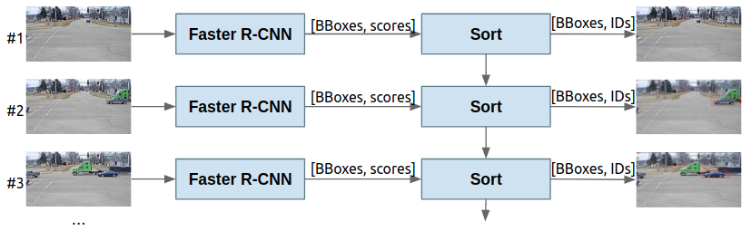

## Week 4
The tasks corresponding to week 4 were devoted to explore the Optical Flow estimation and how it could improve the tracking using it, and Object Detection and tracking of more than one objects at a time in one video sequence.

To implement the estimation of the optical flow we use the Block Matching algorithm with several hyperparameters. Then, we computed the Optical Flow using some open-source python libraries to compare them with our hand-crafted method.

Regarding to the second task, Multiple Object Tracking in a sigle camera, we used the Faster R-CNN as in the previous week since it was the algorithm with best performance. Once the detection was trained, a kalman filter was concatenated right after the Faster R-CNN. We used the SORT implementaton from [Alex Bewley GitHub repository](https://github.com/abewley/sort). The pipeline of the entire model and a detection-tracking example can be seen in the following images.

The division of this week's tasks were the following:
- Task 1.1: Optical Flow estimation using Block Matching
- Task 1.2: Off-the-shelf estimation with open-source libraries
- Task 1.3: Object tracking with Optical Flow
- Task 2: Multi-target single-camera (MTSC) tracking




All the infromation regarding the experiments done during this week can be found at: [Slides](https://docs.google.com/presentation/d/1H0gEhr3EHrW0FNQYGLFsVbwBFW6eT4Jtifmu9MILAZE/edit?usp=sharing)

To run all the sub-sections of section 1 explained in the slides, we have created files denoted as task_{id_task_{...}}.py, where {...} has some further information. These files are to be run as follows:

```
$ python week4/task_{id_task_{...}}.py
```

The ```fasterrcnn.py``` file contains all the code regarding the second task. The file can run the training, inference and tracking just be adding or removing these words in the ACTIONS list. So, to run the MTSC tracking pipiline:
```
$ python week4/fasterrcnn.py
```